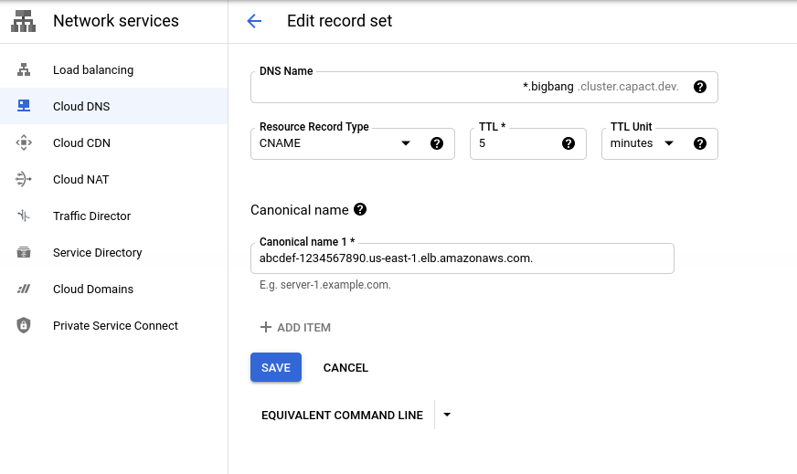

# Kubernetes cluster provisioning with Big Bang installation

This tutorial shows how to create a Platform One environment with Big Bang installed on it.

# Prerequisites

- [Capact CLI](https://capact.io/docs/cli/getting-started/)
- [Docker](https://docs.docker.com/get-docker/)
- [`gh`](https://github.com/cli/cli/releases)
- [`aws` CLI](https://docs.aws.amazon.com/cli/latest/userguide/install-cliv2.html) — for RKE2 installation only
- [`kubectl`](https://kubernetes.io/docs/tasks/tools/)
- [`jq`](https://stedolan.github.io/jq/)

# Capact setup

1. To create a kind environment for Capact:

   <details>
     <summary>For RKE2</summary>

   ```bash
   capact environment create kind
   ```

   </details>

   <details>
     <summary>For k3d</summary>

   ```bash
   sudo sysctl -w vm.max_map_count=262144
   sudo sysctl -w net.netfilter.nf_conntrack_max=524288
   # Turn off all swap devices and files (will not last reboot)
   sudo swapoff -a
   # For swap to stay off you can remove any references found via
   # cat /proc/swaps
   # cat /etc/fstab
   # For Sonarqube
   sudo sysctl -w vm.max_map_count=524288
   sudo sysctl -w fs.file-max=131072
   ulimit -n 131072
   ulimit -u 8192

   cat <<EOF > /tmp/kind-config.yaml
   kind: Cluster
   apiVersion: kind.x-k8s.io/v1alpha4
   nodes:
     - role: control-plane
       kubeadmConfigPatches:
         - |
           kind: InitConfiguration
           nodeRegistration:
             kubeletExtraArgs:
               node-labels: "ingress-ready=true"
       extraPortMappings:
         - containerPort: 80
           hostPort: 8080
           protocol: TCP
         - containerPort: 443
           hostPort: 8443
           protocol: TCP
       extraMounts:
         - containerPath: /var/run/docker.sock
           hostPath: /var/run/docker.sock
           selinuxRelabel: false
   EOF

   capact environment create kind --cluster-config /tmp/kind-config.yaml
   ```

   </details>

1. Install Capact on the kind environment:

   ```bash
   capact install --version @latest --helm-repo-url @latest --capact-overrides "hub-public.populator.manifestsLocation.repository=git@github.com:StructsureLabs/commercial-hub-manifests.git,hub-public.populator.manifestsLocation.branch=main,hub-public.populator.manifestsLocation.sshKey=LS0tLS1CRUdJTiBPUEVOU1NIIFBSSVZBVEUgS0VZLS0tLS0KYjNCbGJuTnphQzFyWlhrdGRqRUFBQUFBQkc1dmJtVUFBQUFFYm05dVpRQUFBQUFBQUFBQkFBQUFNd0FBQUF0emMyZ3RaVwpReU5UVXhPUUFBQUNDMUVQb3pBRktxeFMveDJXVWxWTGhNOEs3UWVvd0g0L2t5MzdZTUlMZXFUZ0FBQUppQVVjSmJnRkhDCld3QUFBQXR6YzJndFpXUXlOVFV4T1FBQUFDQzFFUG96QUZLcXhTL3gyV1VsVkxoTThLN1Flb3dINC9reTM3WU1JTGVxVGcKQUFBRUN5bllWQTl5YjVCWHdtYVRTOUtZalpxSzZGZDJHL1ZBcTdGdVJaLy9oVkI3VVErak1BVXFyRkwvSFpaU1ZVdUV6dwpydEI2akFmaitUTGZ0Z3dndDZwT0FBQUFFV052Ym5SaFkzUkFZMkZ3WVdOMExtbHZBUUlEQkE9PQotLS0tLUVORCBPUEVOU1NIIFBSSVZBVEUgS0VZLS0tLS0K"
   ```

2. Login to Capact by following [this instruction](https://capact.io/docs/cli/getting-started#first-use).

> **NOTE:** When deploying on k3d you have to use a different command to get the gateway host:
> ```bash
> export CAPACT_GATEWAY_HOST="$(kubectl -n capact-system get ingress capact-gateway -ojsonpath='{.spec.rules[0].host}'):8443"
> ```

3. **Only when deploying on RKE2:** Create the AWS credentials TypeInstance:

   ```bash
   export AWS_ACCESS_KEY_ID=<your-aws-access-key>
   export AWS_SECRET_ACCESS_KEY=<your-aws-secret-key>

   cat <<EOF > /tmp/aws-ti.yaml
   typeInstances:
     - attributes:
       - path: cap.attribute.cloud.provider.aws
         revision: 0.1.0
       typeRef:
         path: cap.type.aws.auth.credentials
         revision: 0.1.0
       value:
         accessKeyID: "${AWS_ACCESS_KEY_ID}"
         secretAccessKey: "${AWS_SECRET_ACCESS_KEY}"
   EOF

   capact typeinstance create -f /tmp/aws-ti.yaml
   ```

   Save the AWS credential TypeInstance ID for later.

4. Configure Capact global policies:

   <details>
     <summary>For RKE</summary>

   ```bash
   export AWS_CREDENTIALS_TI_ID=<your-aws-credentials-ti-id>

   cat <<EOF > /tmp/capact-policy.yaml
   apiVersion: 0.1.0
   rules:
     - interface:
         path: cap.interface.containerization.kubernetes.deploy
       oneOf:
         - implementationConstraints:
             path: cap.implementation.aws.containerization.rke2.deploy
           inject:
             typeInstances:
               - id: "${AWS_CREDENTIALS_TI_ID}"
                 typeRef:
                   path: "cap.type.aws.auth.credentials"
                   revision: "0.1.0"

     - interface:
         path: cap.*
       oneOf:
         - implementationConstraints:
             requires:
               - path: "cap.core.type.platform.kubernetes"
         - implementationConstraints: {}
   EOF

   capact policy apply -f /tmp/capact-policy.yaml
   ```

   </details>

   <details>
     <summary>For k3d</summary>

   ```bash
   cat <<EOF > /tmp/capact-policy.yaml
   rules:
     - interface:
         path: cap.interface.containerization.kubernetes.deploy
       oneOf:
         - implementationConstraints:
             path: "cap.implementation.containerization.k3d.deploy"
           inject:
             additionalInput:
               additional-parameters:
                 volumes:
                  - volume: "/etc/machine-id:/etc/machine-id"

                 k3sExtraServerArgs:
                   - --disable=traefik
                 ports:
                   - port: 80:80
                     nodeFilters:
                     - loadbalancer
                   - port: 443:443
                     nodeFilters:
                     - loadbalancer
                 registriesConfig:
                   mirrors:
                     "registry1.dso.mil":
                       endpoint:
                         - 347763108806.dkr.ecr.eu-west-1.amazonaws.com

     - interface:
         path: cap.*
       oneOf:
         - implementationConstraints:
             requires:
               - path: "cap.core.type.platform.kubernetes"
         - implementationConstraints: {}
   EOF

   capact policy apply -f /tmp/capact-policy.yaml
   ```

   </details>

## Big Bang installation

1. Create a new GitHub repository for the Big Bang configuration:

   ```bash
   gh repo create --private big-bang-configuration
   ```

1. Create a TypeInstance for the created GitHub repository:

   ```bash
   export GH_USERNAME=<your-github-username>
   # Personal token can be generated from https://github.com/settings/tokens/new with repo permissions
   export GH_TOKEN=<your-github-personal-token>
   # e.g. https://github.com/StructsureLabs/bb-sample-installation.git
   export GH_REPO=<your-bigbang-conf-repo-https-url>

   cat << EOF > /tmp/git-repo.yaml
   typeInstances:
     - alias: "repository"
       typeRef:
         path: cap.type.git.repository
         revision: 0.1.0
       value:
         url: "${GH_REPO}"
         private: true
         branchName: main
         username: "${GH_USERNAME}"
         password: "${GH_TOKEN}"
   EOF

   capact typeinstance create -f /tmp/git-repo.yaml
   ```

   Export the Git repository TypeInstance ID for later:

   ```bash
   export REPO_TI_ID="<git-repo-typeinstance-it>"
   ```

1. Set your domain configuration variables:

   <details>
     <summary>Using existing domain</summary>

   ```bash
   export DOMAIN_NAME="{your-domain}"
   export DOMAIN_WILDCARD_PRIVATE_KEY="$(cat {path-to-your-key})"
   export DOMAIN_WILDCARD_CERTIFICATE="$(cat {path-to-your-cert})"
   ```

   </details>

   <details>
     <summary>Using bigbang.dev domain with self-signed certificate</summary>

   ```bash
   openssl req -x509 -nodes -days 3650 -newkey rsa:2048 \
     -keyout /tmp/bigbang.local.key -out /tmp/bigbang.local.crt \
     -subj "/CN=*.bigbang.dev/O=Capact" -reqexts SAN \
     -extensions SAN -config <(cat /etc/ssl/openssl.cnf <(printf "\n[ req ]\nx509_extensions = v3_ca\n[SAN]\nsubjectAltName=DNS:bigbang.dev ,DNS:*.bigbang.dev"))

   export DOMAIN_NAME="bigbang.dev"
   export DOMAIN_WILDCARD_PRIVATE_KEY="$(cat /tmp/bigbang.local.key)"
   export DOMAIN_WILDCARD_CERTIFICATE="$(cat /tmp/bigbang.local.crt)"
   ```

   </details>

1. Create the Platform One Action, which will deploy a Platform One environment on AWS and install Big Bang on it:

   ```bash
   cat <<EOF > /tmp/p1-tis.yaml
   typeInstances:
     - name: p1-config-repo
       id: "${REPO_TI_ID}"
   EOF
   cat <<EOF > /tmp/p1-params.yaml
   registry1:
     username: AWS
     password: $(aws ecr get-login-password --region eu-west-1)

   bigbangValues: # optional
     hostname: "${DOMAIN_NAME}"

     # Tune flux for dev
     flux:
       interval: 1m
       rollback:
         cleanupOnFail: false

     logging:
       # Directly modify chart values for dev workloads
       values:
         elasticsearch:
           master:
             count: 1
             resources:
               limits:
                 cpu: 1
                 memory: 3Gi
           data:
             count: 1
             persistence:
               storageClassName: ""
               size: 5Gi
             resources:
               limits:
                 cpu: 1
                 memory: 3Gi

     istio:
       # Directly modify chart values for dev workloads
       values:
         kiali:
           dashboard:
             auth:
               strategy: "anonymous"
         ingressGateway:
           maxReplicas: 1
           serviceAnnotations:
             # Expose all apps externally for testing purposes
             service.beta.kubernetes.io/aws-load-balancer-internal: "false"
             service.beta.kubernetes.io/aws-load-balancer-scheme: "internet-facing"
             # Enable cross zone load balancing
             service.beta.kubernetes.io/aws-load-balancer-cross-zone-load-balancing-enabled: "true"

       ingress:
         cert: |
   $(echo "${DOMAIN_WILDCARD_CERTIFICATE}" | sed -e 's/^/        /')
         key: |
   $(echo "${DOMAIN_WILDCARD_PRIVATE_KEY}" | sed -e 's/^/        /')

     gatekeeper:
       # Directly modify chart values for dev workloads
       values:
         replicas: 1

     twistlock:
       # Directly modify chart values for dev workloads
       values:
         console:
           persistence:
             size: 5Gi
   EOF

   capact action create cap.interface.platform-one.big-bang.provision --name bigbang --parameters-from-file=/tmp/p1-params.yaml --type-instances-from-file=/tmp/p1-tis.yaml
   ```

   You can modify the values in `/tmp/p1-params.yaml`, if needed.

   > **NOTE:** We use a mirror ECR of the IronBank, so we had to provide credentials to the registry in the Action parameters. You need to change this, depending on your registry.

1. Wait till the Action is in `READY_TO_RUN` status:
   ```bash
   capact action get bigbang
   ```

   Then run and wait till the Action is completed. This can take around half an hour.

   ```bash
   capact action run bigbang
   capact action watch bigbang
   ```

1. Configure `/etc/hosts` so you can access the cluster:

   <details>
     <summary>For RKE2 with custom domain</summary>

   Get the kubeconfig TypeInstance ID:
   ```bash
   capact typeinstance get | grep kubeconfig
   ```

   Get the IP address of your LoadBalancer:

   ```bash
   capact typeinstance get {kubeconfig-typeinstance-it} -ojson | jq -r ".[0].firstResourceVersion.spec.value.config" >/tmp/kubeconfig

   export KUBECONFIG=/tmp/kubeconfig

   kubectl get svc -n istio-system istio-ingressgateway -ojsonpath="{.status.loadBalancer.ingress[0].hostname}"
   ```

   Use the hostname/IP address to configure your DNS. An example configuration in GCP Cloud DNS could look like:

   

   </details>

   <details>
     <summary>For RKE2 without custom domain</summary>

   Get the kubeconfig TypeInstance ID:
   ```bash
   capact typeinstance get | grep kubeconfig
   ```

   Get the IP address of your LoadBalancer:

   ```bash
   capact typeinstance get {kubeconfig-typeinstance-it} -ojson | jq -r ".[0].firstResourceVersion.spec.value.config" >/tmp/kubeconfig

   export KUBECONFIG=/tmp/kubeconfig

   host $(kubectl get svc -n istio-system istio-ingressgateway -ojsonpath="{.status.loadBalancer.ingress[0].hostname}")
   ```

   Put the following entry into your `/etc/hosts`:
   ```
   {load-balancer-ip-address}  tracing.bigbang.dev kiali.bigbang.dev kibana.bigbang.dev alertmanager.bigbang.dev grafana.bigbang.dev prometheus.bigbang.dev twistlock.bigbang.dev
   ```

   </details>

   <details>
     <summary>For k3d</summary>

   Put the following entry into your `/etc/hosts`:
   ```
   127.0.0.1  tracing.bigbang.dev kiali.bigbang.dev kibana.bigbang.dev alertmanager.bigbang.dev grafana.bigbang.dev prometheus.bigbang.dev twistlock.bigbang.dev
   ```

   </details>

   <details>
     <summary>For k3d on an EC2 instance with public IP address</summary>


   Put the following entry into your `/etc/hosts`:
   ```
   {public-ip-address-of-instance}  tracing.bigbang.dev kiali.bigbang.dev kibana.bigbang.dev alertmanager.bigbang.dev grafana.bigbang.dev prometheus.bigbang.dev twistlock.bigbang.dev
   ```

   </details>

1. Test that it works:

   Get the connection details to Grafana using the following command:

   ```bash
   capact action get bigbang -ojson | jq -r '.Actions[0].output.typeInstances[] | select( .typeRef.path == "cap.type.platform-one.big-bang.config" ) | .id' | xargs capact typeinstance get -ojson | jq -r '.[0].latestResourceVersion.spec.value'
   ```

   You should see a response like this, with the Grafana host, username and password:
   ```json
   {
     "grafana": {
       "host": "https://grafana.bigbang.dev",
       "password": "...",
       "username": "..."
     },
     "istioGateway": {
       "hostname": "",
       "ip": "172.24.0.2"
     }
   }
   ```

   Open Grafana in your browser and confirm it works.

   > **NOTE:** You might get a certificate issue in your browser, if you used a self-signed certificate for the BigBang ingress. In this case you have to add the certificate to your truststore.
